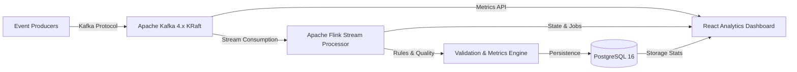

# IceStream 

> Enterprise Real-Time Data Streaming & Analytics Platform

IceStream is a high-performance, fault-tolerant real-time streaming analytics platform built to ingest, process, validate, and visualize high-throughput event streams in real time.

---

##  Architecture & Tech Stack



- **Messaging Infrastructure:** Apache Kafka 4.3.1 (KRaft mode)
- **Stream Processing:** Apache Flink 1.20.1
- **Storage Layer:** PostgreSQL 16.4
- **Analytics Dashboard:** React 19 + Vite + Recharts + Lucide Icons (Vanilla CSS Dark Theme)

---

##  Dashboard Capabilities

The IceStream frontend is an enterprise dark-mode analytics dashboard featuring:

1. **Stream Pipeline Topology:** End-to-end visual data flow (Producers → Kafka → Flink → Validation → PostgreSQL) with live processing rates and latency badges.
2. **Infrastructure Health Status Cards:**
   - **Apache Kafka:** Broker count, active topics, total partitions, messages/sec throughput.
   - **Apache Flink:** Running stream jobs, task manager slots, checkpoint success rate, backpressure status.
   - **PostgreSQL:** Active DB connections, database storage size, query execution rate, cache hit ratio.
   - **Live Event Counter:** Real-time animated counter with streaming rate (events/sec) and dynamic sparkline chart.
3. **Message Throughput Chart:** Dual area chart (Messages In vs. Messages Out) powered by Recharts with time-series sampling and gradient fills.
4. **Validation Metrics Panel:** Circular SVG progress rings (Pass Rate, Schema Compliance, Quality) + numeric breakdown of passed/failed/warning events.
5. **Recent Events Data Stream Table:**
   - Real-time auto-ingest stream simulator (Live/Pause toggle).
   - Search bar filter (Event ID, Topic).
   - Status filters (All, Success, Warning, Error).
   - CSV Export feature.
   - Click-to-inspect Event Payload JSON Viewer modal with 1-click clipboard copy.

---

##  Getting Started

### Prerequisites
- Node.js 18+ and `npm`
- Docker & Docker Compose (optional for local Kafka container)

### 1. Launching the Analytics Dashboard

```bash
# Navigate to the frontend directory
cd frontend

# Install dependencies (if not already installed)
npm install

# Start the Vite development server
npm run dev
```

Open [http://localhost:5173](http://localhost:5173) in your browser.

### 2. Building for Production

```bash
cd frontend
npm run build
```

### 3. Launching Local Infrastructure (Kafka KRaft)

```bash
# Start Kafka 4.x container
docker compose -f docker/docker-compose.yml up -d
```

---

##  Project Directory Structure

```
IceStream/
├── docker/
│   └── docker-compose.yml     # Kafka 4.3.1 KRaft cluster setup
├── frontend/                  # React 19 + Vite analytics app
│   ├── public/
│   ├── src/
│   │   ├── components/
│   │   │   ├── StatusCard.jsx
│   │   │   ├── LiveEventCounter.jsx
│   │   │   ├── ThroughputChart.jsx
│   │   │   ├── ValidationMetrics.jsx
│   │   │   ├── RecentEventsTable.jsx
│   │   │   └── PipelineTopology.jsx
│   │   ├── data/
│   │   │   └── dummyData.js
│   │   ├── App.jsx
│   │   ├── index.css
│   │   └── main.jsx
│   ├── index.html
│   ├── package.json
│   └── vite.config.js
└── README.md
```

---

##  License

Licensed under the [MIT License](LICENSE).
